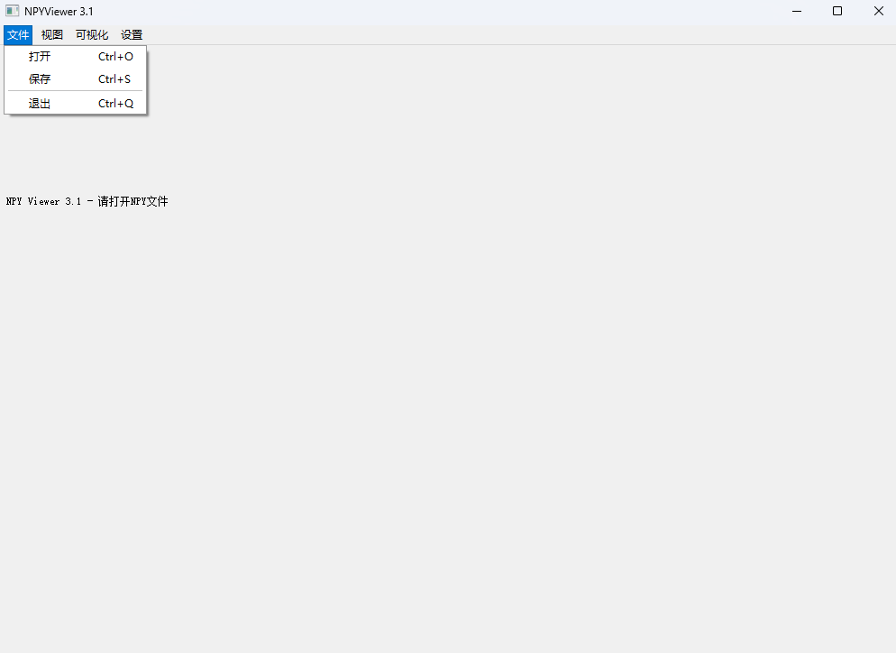
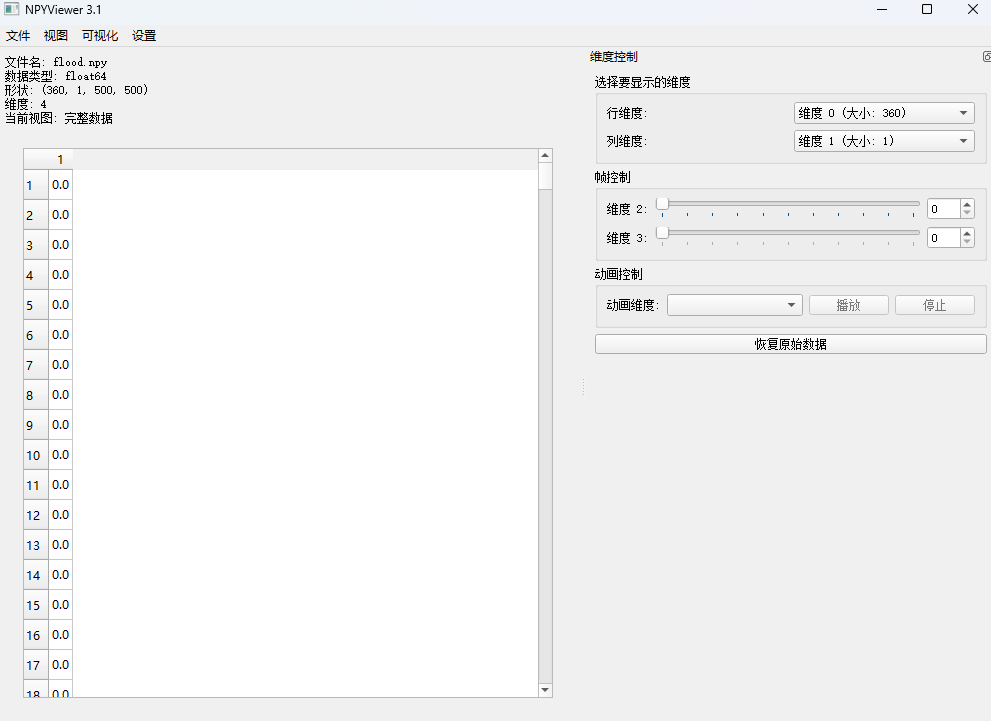
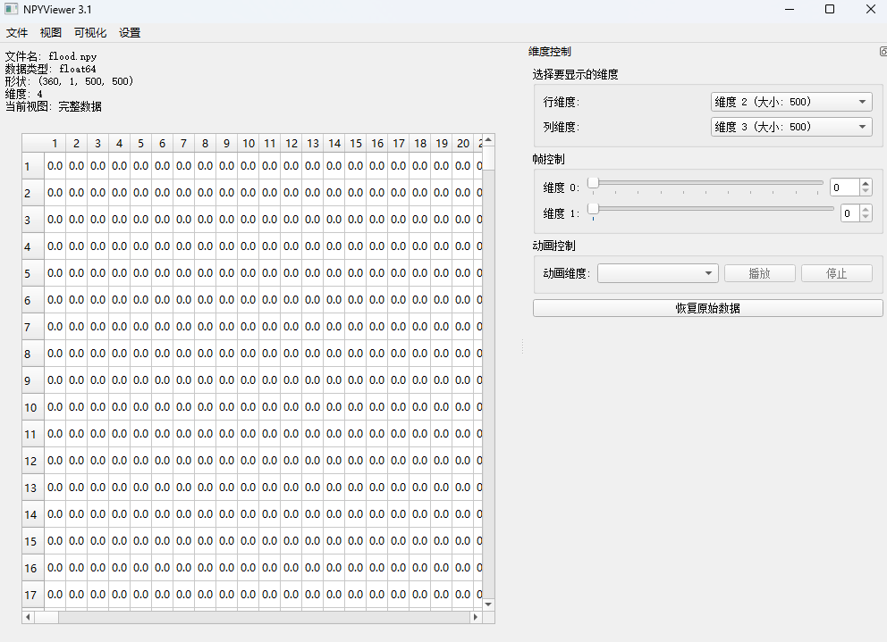
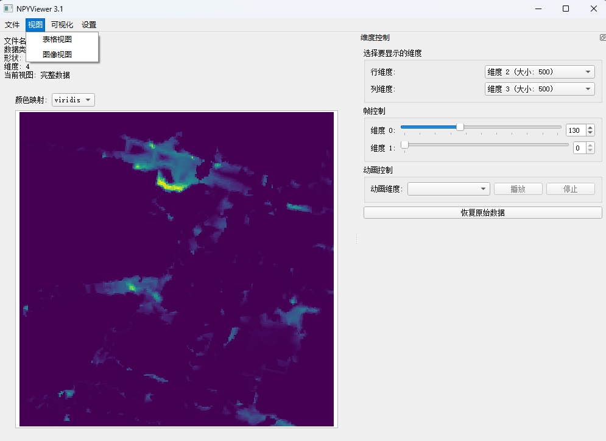
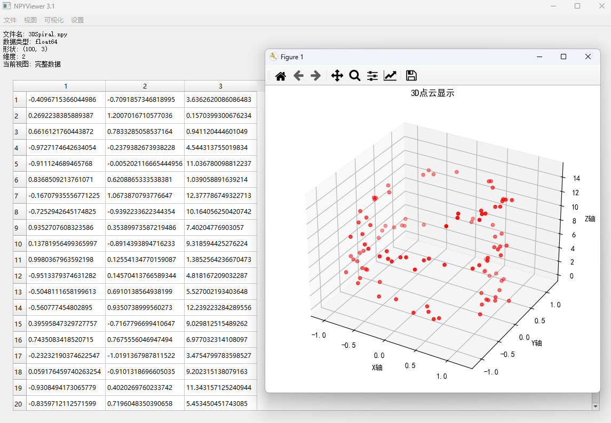
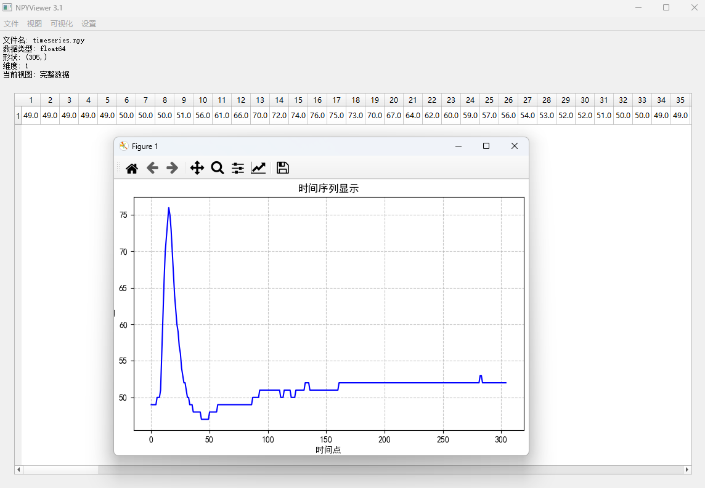

# NPYViewer 3.1

NPYViewer 3.1 是一个高效的 NumPy 数组可视化与编辑工具，提供丰富的功能以支持高维数据的展示和操作。该项目基于之前的版本进行了全面的重构和功能增强，以适应处理中大型多维数据集。

⭐本项目基于[csmailis/NPYViewer](https://github.com/csmailis/NPYViewer)项目思路改进

## 主要功能特点

- **多维数据支持**：能够处理和可视化最多 N 维的 NumPy 数组，灵活选择任意两个维度进行展示
- **智能数据限制**：当数据任意一个维度大于 500 时，自动启用数据限制功能，防止大型数据集导致程序卡顿或崩溃
- **多种视图模式**：
  - **表格视图**：以精确数值方式查看数据
  - **图像视图**：以颜色渲染方式直观展示数据分布，支持多种颜色映射方案
- **丰富的可视化选项**：
  - **灰度图**：适合查看单通道图像数据
  - **热力图**：适合展示数据强度分布
  - **3D点云**：三维数据可视化
  - **时间序列**：适用于一维数据随时间变化分析
  - **有向图**：基于邻接矩阵的网络数据可视化
- **交互式维度控制**：
  - 灵活选择要显示的行/列维度
  - 通过滑块精确控制非显示维度的切片索引
  - 支持动画播放功能，自动循环切换特定维度的所有切片
- **完整的文件操作**：
  - 支持打开 NPY 和 CSV 文件
  - 支持导出为 NPY、CSV 和 MAT 格式

## 安装指南

### 系统要求
- Python 3.6 或更高版本
- 适用于 Windows、macOS 和 Linux

### 安装步骤

```bash
# 克隆仓库
git clone https://github.com/xxxxx/NPYViewer-3.1.git
# 或下载解压压缩包
cd NPYViewer-3.1

# 安装依赖
pip install -r requirements.txt
```

## 详细使用教程

### 基本操作

1. **启动应用程序**：
   ```bash
   python src/main.py
   ```


2. **打开文件**：
   - 点击"文件" → "打开"，或使用快捷键 `Ctrl+O`
   - 选择 NPY 或 CSV 文件
  

3. **切换视图模式**：
   - 点击"视图" → "表格视图" 或 "图像视图"
   - 图像视图下可以通过下拉菜单切换不同的颜色映射方案
  
  
  

### 高维数据操作

1. **维度选择**：
   - 在右侧"维度控制"面板中，选择要显示的行维度和列维度
   - 其他维度会显示为可调整的滑块

2. **切片控制**：
   - 使用滑块或微调框调整非显示维度的切片位置
   - 每调整一次，视图会即时更新显示对应的数据切片

3. **动画播放**：
   - 从"动画维度"下拉菜单选择要动画显示的维度
   - 点击"播放"按钮开始自动循环所选维度的所有切片
   - 点击"暂停"或"停止"控制动画

### 数据可视化

1. **创建特定可视化**：
   - 点击"可视化"菜单选择所需的可视化类型
   - 根据当前数据的维度和形状，某些可视化选项可能不可用
  
  

2. **图像视图颜色映射**：
   - 在图像视图模式下，从颜色映射下拉菜单选择不同的配色方案
   - 可用选项包括：viridis、plasma、inferno、magma、cividis、gray、hot、cool、rainbow、jet

### 数据显示限制设置

1. **访问设置**：
   - 点击"设置" → "数据显示限制"

2. **调整设置**：
   - 启用/禁用数据限制功能
   - 自定义最大显示行数和列数
   - 默认设置：当数据任意维度大于500时自动启用，限制为500行×500列

3. **注意事项**：
   - 当限制生效时，视图上会显示"已限制显示"的提示
   - 这不会改变原始数据，仅影响显示

## 文件格式支持

- **打开格式**：
  - NumPy 数组 (.npy)
  - CSV 文件 (.csv)

- **保存格式**：
  - NumPy 数组 (.npy)
  - CSV 文件 (.csv) 
  - MATLAB 矩阵 (.mat)

## 文件结构说明

- main.py：程序入口和主窗口实现
- data_handler.py：处理文件加载、保存和数据操作
- visualizers.py：实现各种可视化模式和类型
- slice_controls.py：高维数据切片控制和动画功能
- data_limit_dialog.py：数据显示限制设置对话框
- requirements.txt：依赖包列表

## 注意事项

- 对于非常大的数据集（任意维度大于500），程序会自动启用数据限制功能，只显示部分数据
- 处理高维数据时，建议增大系统内存或调整数据限制设置以获得最佳性能
- 3D点云可视化需要数据包含至少3个值或维度

## 未来开发计划

- [ ] 增加更多可视化类型（如等高线图、散点图等）
- [ ] 优化性能以支持更大的数据集
- [ ] 提供数据过滤和处理功能
- [ ] 添加统计分析工具
- [ ] 支持更多文件格式（如HDF5、NetCDF）
- [ ] 优化csv文件的自动转换及筛选功能
- [ ] 支持项目内文件浏览器及数据切换

## 升级日志

- **问题1**: 打开大文件时程序响应缓慢
  **解决方案**: 在"设置"中调整数据限制参数，降低最大行数和列数

- **问题2**: 无法正确显示高维数据
  **解决方案**: 确保选择了合适的维度进行显示，其他维度设置正确的索引

## 许可证

本项目采用MIT许可证 - 详情请参阅LICENSE.md文件。

# 🔍 NPYViewer 3.1


> 💫 NPYViewer 3.1 是一个高效的 NumPy 数组可视化与编辑工具，提供丰富的功能以支持高维数据的展示和操作。该项目基于之前的版本进行了全面的重构和功能增强，以适应处理中大型多维数据集。

本项目基于[csmailis/NPYViewer](https://github.com/csmailis/NPYViewer)项目改进 ✨

## 🚀 主要功能特点

- **📊 多维数据支持**：能够处理和可视化最多 N 维的 NumPy 数组，灵活选择任意两个维度进行展示
- **⚡ 智能数据限制**：当数据任意一个维度大于 500 时，自动启用数据限制功能，防止大型数据集导致程序卡顿或崩溃
- **👁️ 多种视图模式**：
  - **📋 表格视图**：以精确数值方式查看数据
  - **🖼️ 图像视图**：以颜色渲染方式直观展示数据分布，支持多种颜色映射方案
- **📈 丰富的可视化选项**：
  - **⚪ 灰度图**：适合查看单通道图像数据
  - **🔥 热力图**：适合展示数据强度分布
  - **✨ 3D点云**：三维数据可视化
  - **📉 时间序列**：适用于一维数据随时间变化分析
  - **🔄 有向图**：基于邻接矩阵的网络数据可视化
- **🎛️ 交互式维度控制**：
  - 💡 灵活选择要显示的行/列维度
  - 🎚️ 通过滑块精确控制非显示维度的切片索引
  - ▶️ 支持动画播放功能，自动循环切换特定维度的所有切片
- **📂 完整的文件操作**：
  - 📤 支持打开 NPY 和 CSV 文件
  - 📥 支持导出为 NPY、CSV 和 MAT 格式

## 💻 安装指南

### 系统要求
- 🐍 Python 3.6 或更高版本
- 🖥️ 适用于 Windows、macOS 和 Linux

### 安装步骤

```bash
# 克隆仓库
git clone https://github.com/xxxxx/NPYViewer-3.1.git
# 或下载解压压缩包
cd NPYViewer-3.1

# 安装依赖
pip install -r requirements.txt
```

## 📖 详细使用教程

### 🔰 基本操作

1. **🚀 启动应用程序**：
   ```bash
   python src/main.py
   ```

2. **📂 打开文件**：
   - 点击"文件" → "打开"，或使用快捷键 <kbd>Ctrl</kbd>+<kbd>O</kbd>
   - 选择 NPY 或 CSV 文件
    
   
   

3. **👁️ 切换视图模式**：
   - 点击"视图" → "表格视图" 或 "图像视图"
   - 图像视图下可以通过下拉菜单切换不同的颜色映射方案
  
  
  

### 🧩 高维数据操作

1. **🔀 维度选择**：
   - 在右侧"维度控制"面板中，选择要显示的行维度和列维度
   - 其他维度会显示为可调整的滑块

2. **🔎 切片控制**：
   - 使用滑块或微调框调整非显示维度的切片位置
   - 每调整一次，视图会即时更新显示对应的数据切片

3. **▶️ 动画播放**：
   - 从"动画维度"下拉菜单选择要动画显示的维度
   - 点击"播放"按钮开始自动循环所选维度的所有切片
   - 点击"暂停"或"停止"控制动画

### 📊 数据可视化

1. **🎨 创建特定可视化**：
   - 点击"可视化"菜单选择所需的可视化类型
   - 根据当前数据的维度和形状，某些可视化选项可能不可用
  
  
  

2. **🎭 图像视图颜色映射**：
   - 在图像视图模式下，从颜色映射下拉菜单选择不同的配色方案
   - 可用选项包括：
     - 🌈 viridis、plasma、inferno、magma、cividis
     - ⚪ gray
     - 🔥 hot
     - ❄️ cool
     - 🌈 rainbow、jet

### ⚙️ 数据显示限制设置

1. **🔧 访问设置**：
   - 点击"设置" → "数据显示限制"

2. **🛠️ 调整设置**：
   - ✅ 启用/禁用数据限制功能
   - 📏 自定义最大显示行数和列数
   - ℹ️ 默认设置：当数据任意维度大于500时自动启用，限制为500行×500列

3. **⚠️ 注意事项**：
   - 当限制生效时，视图上会显示"已限制显示"的提示
   - 这不会改变原始数据，仅影响显示

## 📄 文件格式支持

| 🔣 操作类型 | 支持的格式 |
|---------|---------|
| **📥 打开格式** | NumPy 数组 (.npy)<br>CSV 文件 (.csv) |
| **📤 保存格式** | NumPy 数组 (.npy)<br>CSV 文件 (.csv)<br>MATLAB 矩阵 (.mat) |

## 📁 文件结构说明

| 📄 文件名 | 📝 功能描述 |
|---------|---------|
| `main.py` | 程序入口和主窗口实现 |
| `data_handler.py` | 处理文件加载、保存和数据操作 |
| `visualizers.py` | 实现各种可视化模式和类型 |
| `slice_controls.py` | 高维数据切片控制和动画功能 |
| `data_limit_dialog.py` | 数据显示限制设置对话框 |
| requirements.txt | 依赖包列表 |

## ⚠️ 注意事项

- 🚫 对于非常大的数据集（任意维度大于500），程序会自动启用数据限制功能，只显示部分数据
- 💾 处理高维数据时，建议增大系统内存或调整数据限制设置以获得最佳性能
- 📌 3D点云可视化需要数据包含至少3个值或维度

## 🔮 未来开发计划

- [ ] 🌟 增加更多可视化类型（如等高线图、散点图等）
- [ ] ⚡ 优化性能以支持更大的数据集
- [ ] 🔍 提供数据过滤和处理功能
- [ ] 📊 添加统计分析工具
- [ ] 📁 支持更多文件格式（如HDF5、NetCDF）
- [ ] 🔄 优化csv文件的自动转换及筛选功能
- [ ] 🗂️ 支持项目内文件浏览器及数据切换

## 🔧 升级日志

- **🐞 问题1**: 打开大文件时程序响应缓慢
  **✅ 解决方案**: 在"设置"中调整数据限制参数，降低最大行数和列数

- **🐞 问题2**: 无法正确显示高维数据
  **✅ 解决方案**: 确保选择了合适的维度进行显示，其他维度设置正确的索引

## 📜 许可证

本项目采用 MIT 许可证。

---

<p align="center">
  
  <br>
  👨‍💻 欢迎提交 Issues 和 Pull Requests！
</p>
